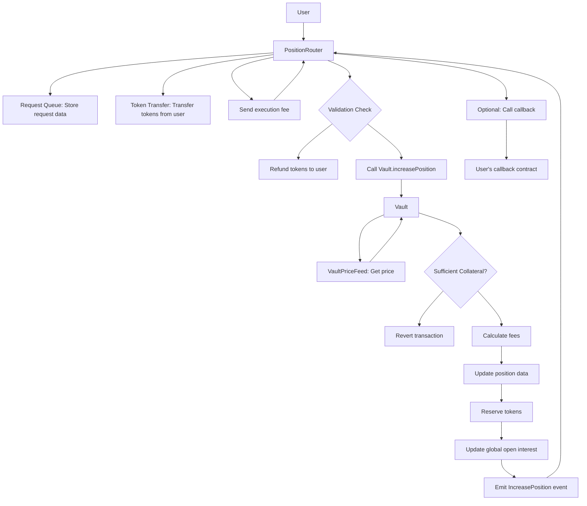
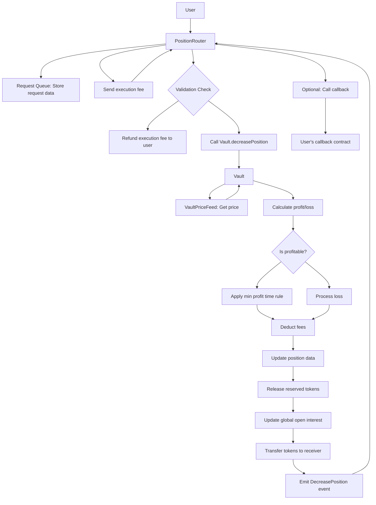
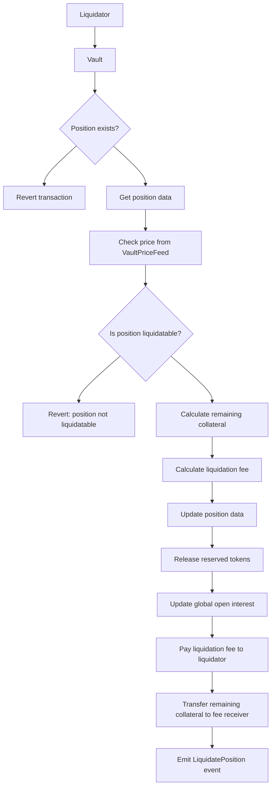
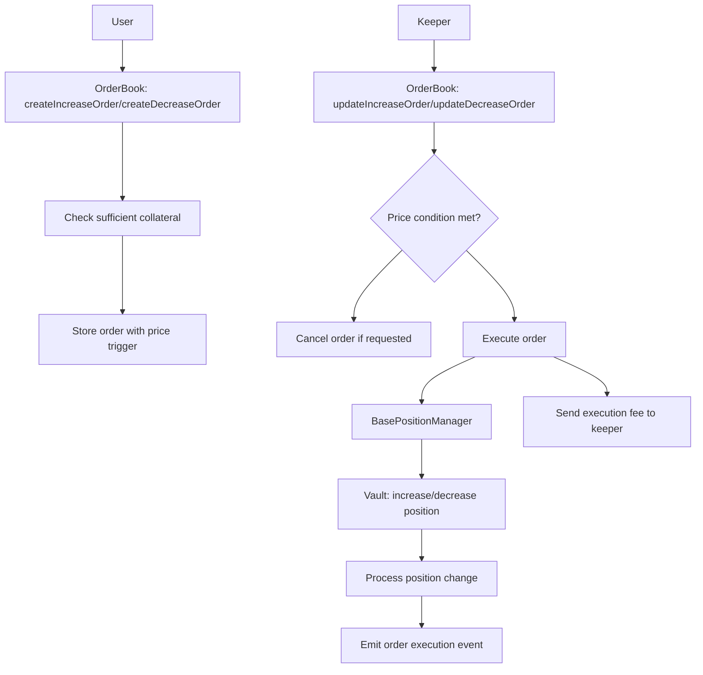
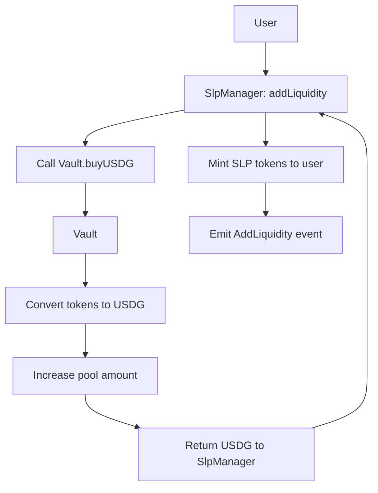

# Protocol Flow Charts

This page provides visual flowcharts that illustrate the main processes in the Satoshi Perps protocol. Understanding these flows is essential for traders, developers, and integrators.

## Position Lifecycle

## Opening a Position

The following flow chart illustrates the complete process of opening a position through the protocol:

**Position Opening Steps:**
1. User calls `createIncreasePosition` on [PositionRouter](/contracts/position-router)
2. PositionRouter stores request data in queue
3. PositionRouter transfers tokens from user
4. Keeper calls `executeIncreasePosition` on PositionRouter
5. PositionRouter validates request parameters
6. If invalid, tokens are refunded to user
7. If valid, calls [Vault](/contracts/vault)'s `increasePosition` function
8. Vault gets price from [VaultPriceFeed](/contracts/vault-price-feed)
9. Vault verifies sufficient collateral
10. Vault calculates fees, updates position data
11. Vault reserves tokens and updates global open interest
12. PositionRouter executes optional callback
13. PositionRouter sends execution fee to keeper

## Closing a Position

This flow chart shows the process of closing or decreasing a position:

**Position Closing Steps:**
1. User calls `createDecreasePosition` on [PositionRouter](/contracts/position-router)
2. PositionRouter stores request data in queue
3. Keeper calls `executeDecreasePosition` on PositionRouter
4. PositionRouter validates request parameters
5. If invalid, execution fee is refunded to user
6. If valid, calls [Vault](/contracts/vault)'s `decreasePosition` function
7. Vault gets price from [VaultPriceFeed](/contracts/vault-price-feed)
8. Vault calculates profit or loss
9. If profitable, applies minimum profit time rule
10. If not, processes the loss
11. Deducts fees and updates position data
12. Releases reserved tokens and updates open interest
13. Transfers tokens to the receiver
14. PositionRouter executes optional callback
15. PositionRouter sends execution fee to keeper

## Liquidation Process

This flow chart illustrates the liquidation process for underwater positions:

**Liquidation Steps:**
1. Liquidator calls `liquidatePosition` on [Vault](/contracts/vault)
2. Vault checks if the position exists
3. If it doesn't exist, reverts the transaction
4. If it exists, gets the position data
5. Checks current price from [VaultPriceFeed](/contracts/vault-price-feed)
6. Determines if position is liquidatable based on leverage and collateral
7. If not liquidatable, reverts the transaction
8. If liquidatable, calculates remaining collateral
9. Calculates liquidation fee for the liquidator
10. Updates position data (zeroes out the position)
11. Releases reserved tokens
12. Updates global open interest
13. Pays liquidation fee to the liquidator
14. Transfers remaining collateral to fee receiver
15. Emits LiquidatePosition event

## Order Execution Process

This flow chart illustrates how limit orders are processed by the OrderBook contract:

**Order Execution Steps:**
1. User creates an order via the [OrderBook](/contracts/order-book) contract
2. OrderBook checks if the user has provided sufficient collateral
3. Order is stored with price trigger conditions
4. Keeper periodically calls update functions to check if orders can be executed
5. OrderBook checks if price conditions are met
6. If conditions are met, executes the order via [BasePositionManager](/contracts/base-position-manager)
7. BasePositionManager calls the [Vault](/contracts/vault) to execute the position change
8. Execution fee is paid to the keeper

## Liquidity Provision Flow

**Liquidity Provision Steps:**
1. User calls `addLiquidity` on [SlpManager](/contracts/slp-manager)
2. SlpManager calls [Vault](/contracts/vault)'s `buyUSDG` function
3. Vault converts tokens to USDG stablecoins
4. Vault increases the pool amount for the token
5. USDG is returned to SlpManager
6. SlpManager mints SLP tokens to the user based on the current SLP price
7. AddLiquidity event is emitted

See each individual contract's documentation for more detailed information about specific functions and mechanisms.