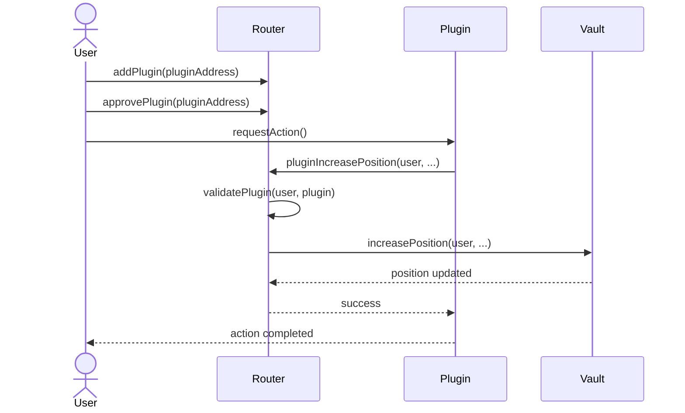

# Router

The Router serves as a central entry point for user interactions with the Satoshi Perps protocol. It manages plugins, handles token approvals, and provides functionality for token swapping and position modifications through authorized plugins.

## Contract Overview

The Router handles:
- Managing plugin registrations and permissions
- Handling token approvals for the Vault
- Wrapping and unwrapping ETH for interactions
- Providing interfaces for plugins to modify positions
- Facilitating token swaps through the Vault

<Info>
The Router uses a plugin-based architecture to allow modular extensions of functionality while maintaining security.
</Info>

## Key Functions

### Plugin Management

```solidity
function addPlugin(address _plugin) external;
```

Allows users to register a plugin address that can execute actions on their behalf.

```solidity
function removePlugin(address _plugin) external;
```

Removes a previously registered plugin.

### Token Approvals

```solidity
function approvePlugin(address _plugin) external;
```

Approves a plugin to use the user's tokens via the Router.

```solidity
function approvePlugin(address _token, address _spender) external;
```

Approves a specific token to be spent by the specified spender.

### Position Management via Plugins

```solidity
function pluginIncreasePosition(
    address _account,
    address _collateralToken,
    address _indexToken,
    uint256 _sizeDelta,
    bool _isLong
) external;
```

Allows an authorized plugin to increase a position for the specified account.

```solidity
function pluginDecreasePosition(
    address _account,
    address _collateralToken,
    address _indexToken,
    uint256 _collateralDelta,
    uint256 _sizeDelta,
    bool _isLong,
    address _receiver
) external returns (uint256);
```

Allows an authorized plugin to decrease a position for the specified account.

### Token Swapping

```solidity
function swap(
    address[] memory _path,
    uint256 _amountIn,
    uint256 _minOut,
    address _receiver
) external;
```

Swaps tokens through the Vault's swap mechanism.

```solidity
function swapETHToTokens(
    address[] memory _path,
    uint256 _minOut,
    address _receiver
) external payable;
```

Swaps ETH to tokens through the Vault's swap mechanism.

## Plugin Architecture

The Router implements a permission system that allows plugins to execute actions on behalf of users:

1. Users must first register a plugin using `addPlugin`
2. Then they must approve the plugin using `approvePlugin`
3. Only after both steps can a plugin execute actions on behalf of the user

<Warning>
Only approve plugins that you trust, as they will have significant control over your funds and positions in the protocol.
</Warning>

### Plugin Authorization Flow



## ETH Handling

The Router provides convenience functions for handling ETH:

```solidity
function sendETHToVault(uint256 _amount) external;
```

Converts ETH to WETH and sends it to the Vault.

```solidity
function unwrapETH(uint256 _amount, address _receiver) external;
```

Unwraps WETH to ETH and sends it to the specified receiver.

## Integration with Vault

The Router interacts with the Vault in several ways:

1. **Position Management**: Forwards position modifications to the Vault
2. **Token Swaps**: Uses the Vault's swap functionality
3. **Token Approvals**: Manages approvals for the Vault to use tokens

## Security Considerations

The Router implements several security features:

- **Plugin Validation**: Ensures plugins are authorized by the user
- **Permission System**: Only approved plugins can execute actions
- **Reentrancy Protection**: Prevents reentrancy attacks
- **Access Controls**: Restricts sensitive functions to authorized callers

<Note>
The Router does not store user funds directly. Funds are always managed by the Vault contract.
</Note>

## Example: Using the Router with PositionManager

<Steps>
  <Step title="Register the PositionManager">
    First, a user registers the PositionManager as a plugin.
    
    ```javascript
    // Add the position manager as a plugin
    await router.addPlugin(positionManagerAddress);
    
    // Approve the position manager plugin
    await router.approvePlugin(positionManagerAddress);
    ```
  </Step>
  <Step title="Approve Tokens">
    The user approves tokens to be used by the Router.
    
    ```javascript
    // Approve WETH
    await weth.approve(routerAddress, ethers.constants.MaxUint256);
    
    // Approve USDC
    await usdc.approve(routerAddress, ethers.constants.MaxUint256);
    ```
  </Step>
  <Step title="Interact via PositionManager">
    Now the user can interact with the PositionManager, which uses the Router as an intermediary.
    
    ```javascript
    // Open a long position through the position manager
    await positionManager.increasePosition(
      [wethAddress], // Token path
      wethAddress, // Index token (ETH)
      ethers.utils.parseEther("1"), // Amount in
      0, // Min output amount (no swap)
      ethers.utils.parseUnits("5", 30), // Size delta (5x leverage)
      true, // Is long
      ethers.utils.parseUnits("2000", 30) // Acceptable price
    );
    ```
  </Step>
</Steps>

## Common Use Cases

<CardGroup cols={2}>
  <Card title="Position Manager Integration" icon="arrows-up-down">
    The Router enables the PositionManager to modify positions in the Vault on behalf of users
  </Card>
  <Card title="Order Book Integration" icon="book">
    The Router allows the OrderBook to execute limit orders when conditions are met
  </Card>
  <Card title="Position Router Integration" icon="route">
    Enables the PositionRouter to process queued position requests
  </Card>
  <Card title="Custom Plugins" icon="puzzle-piece">
    Developers can create custom plugins that interact with the protocol via the Router
  </Card>
</CardGroup>

## Extending with Custom Plugins

The Router's plugin architecture enables developers to extend the protocol's functionality:

```solidity
// Example of a simple custom plugin that automatically adds collateral
// when a position's leverage exceeds a threshold
contract LeverageGuardian {
    Router public router;
    Vault public vault;
    
    constructor(address _router, address _vault) {
        router = Router(_router);
        vault = Vault(_vault);
    }
    
    function guardPosition(
        address _collateralToken,
        address _indexToken,
        bool _isLong
    ) external {
        // Get position info
        (uint256 size, uint256 collateral, , , , , , ) = vault.getPosition(
            msg.sender,
            _collateralToken,
            _indexToken,
            _isLong
        );
        
        // Check if leverage is too high (e.g., > 10x)
        if (size > collateral * 10) {
            // Calculate additional collateral needed
            uint256 additionalCollateral = size / 5 - collateral;
            
            // Add collateral through the router
            router.pluginIncreasePosition(
                msg.sender,
                _collateralToken,
                _indexToken,
                0, // No size increase
                _isLong
            );
        }
    }
}
```