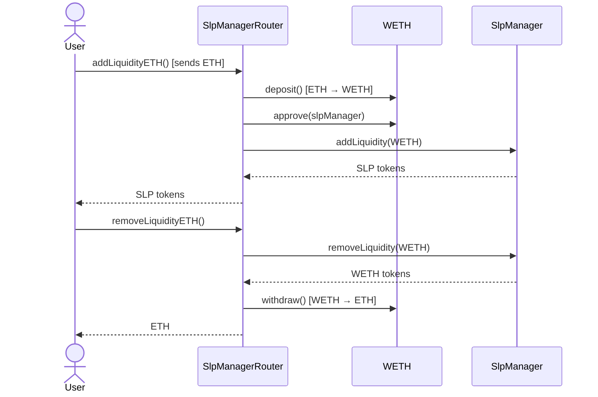

# SlpManagerRouter

The SlpManagerRouter is a convenience contract that simplifies the process of providing liquidity to the Satoshi Perps protocol. It handles ETH wrapping/unwrapping and token routing to make liquidity provision more user-friendly.

## Contract Overview

The SlpManagerRouter handles:
- Adding liquidity to the protocol using ETH
- Adding liquidity using ERC20 tokens
- Removing liquidity with option to receive ETH
- Routing liquidity operations to the SlpManager

<Info>
The SlpManagerRouter primarily serves as a user-friendly interface on top of the SlpManager contract.
</Info>

## Key Functions

### Adding Liquidity

```solidity
function addLiquidity(
    address _token,
    uint256 _amount,
    uint256 _minSlp,
    uint256 _minToken
) external returns (uint256);
```

Adds liquidity using an ERC20 token and returns SLP tokens.

```solidity
function addLiquidityETH(
    uint256 _minSlp,
    uint256 _minToken
) external payable returns (uint256);
```

Adds liquidity using ETH, which is automatically wrapped to WETH before being sent to the SlpManager.

### Removing Liquidity

```solidity
function removeLiquidity(
    address _tokenOut,
    uint256 _slpAmount,
    uint256 _minOut,
    address _receiver
) external returns (uint256);
```

Burns SLP tokens and returns the underlying token to the specified receiver.

```solidity
function removeLiquidityETH(
    uint256 _slpAmount,
    uint256 _minOut,
    address payable _receiver
) external returns (uint256);
```

Burns SLP tokens and returns ETH (unwrapped from WETH) to the specified receiver.

## ETH Handling

The SlpManagerRouter automatically handles the conversion between ETH and WETH:

1. When a user calls `addLiquidityETH()`, the router:
   - Receives the ETH
   - Wraps it to WETH using the WETH contract's `deposit()` function
   - Approves the SlpManager to use the WETH
   - Calls the SlpManager's `addLiquidity()` function

2. When a user calls `removeLiquidityETH()`, the router:
   - Calls the SlpManager's `removeLiquidity()` function to get WETH
   - Unwraps the WETH to ETH using the WETH contract's `withdraw()` function
   - Transfers the ETH to the user's specified receiver address

## Integration with SlpManager

The SlpManagerRouter works as a thin wrapper around the SlpManager:



## Security Considerations

The SlpManagerRouter implements several security features:
- **Slippage Protection**: Uses minimum output parameters to protect users
- **Direct Transfers**: Transfers tokens directly to the specified receiver
- **Reentrancy Prevention**: Follows checks-effects-interactions pattern
- **Access Control**: Only allows authorized operations

<Note>
While the SlpManagerRouter handles ETH conversions, all the core liquidity logic remains in the SlpManager contract.
</Note>

## Example Usage

<Steps>
  <Step title="Adding Liquidity with ETH">
    A user wants to provide 5 ETH as liquidity to the protocol.
    
    ```javascript
    const ethAmount = ethers.utils.parseEther("5");
    const minSlp = ethers.utils.parseEther("4.75"); // 5% slippage protection
    
    await slpManagerRouter.addLiquidityETH(
      minSlp, // Minimum SLP tokens to receive
      0, // Minimum token (not relevant for deposit)
      { value: ethAmount } // 5 ETH
    );
    ```
  </Step>
  <Step title="Removing Liquidity to ETH">
    Later, the user wants to withdraw their liquidity and receive ETH.
    
    ```javascript
    const slpAmount = await slpToken.balanceOf(userAddress);
    const minEthOut = ethers.utils.parseEther("4.75"); // 5% slippage protection
    
    await slpManagerRouter.removeLiquidityETH(
      slpAmount, // SLP amount to burn
      minEthOut, // Minimum ETH to receive
      userAddress // Receiver address
    );
    ```
  </Step>
</Steps>

## Benefits of Using the Router

Using the SlpManagerRouter provides several benefits over interacting directly with the SlpManager:

1. **Simplified UX**: Users can interact using native ETH without manually wrapping/unwrapping
2. **Gas Efficiency**: Combines multiple transactions into a single operation
3. **Easier Integration**: Frontends and dApps can provide a more streamlined experience

<Warning>
When using the router, be aware that the actual liquidity operations are still subject to the rules of the SlpManager, including any cooldown periods for withdrawals.
</Warning>